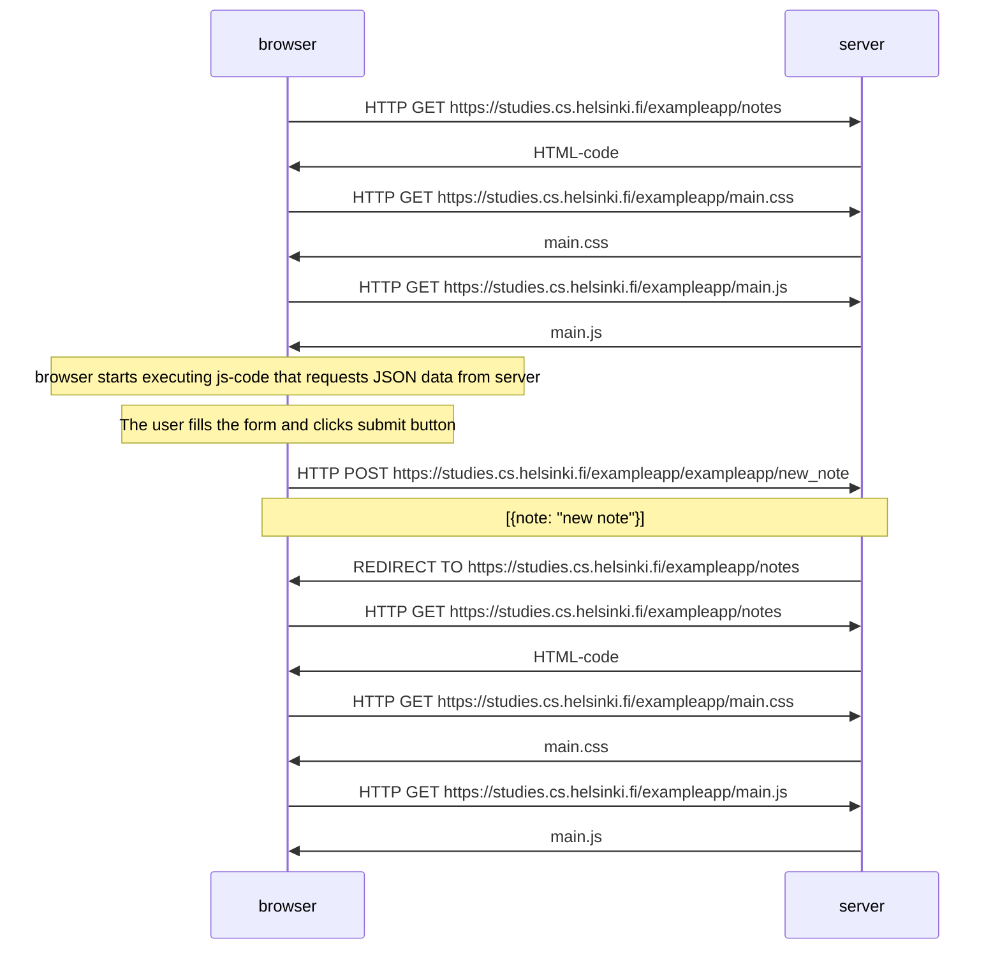

```mermaid
sequenceDiagram
    participant browser
    participant server
    
    browser ->> server : HTTP GET https://studies.cs.helsinki.fi/exampleapp/notes 
    server ->> browser: HTML-code
    browser ->> server: HTTP GET https://studies.cs.helsinki.fi/exampleapp/main.css
    server ->> browser: main.css
    browser ->> server: HTTP GET https://studies.cs.helsinki.fi/exampleapp/main.js
    server ->> browser: main.js
    
    note over browser: browser starts executing js-code that requests JSON data from server
    note over browser: The user fills the form and clicks submit button 
    browser ->> server: HTTP POST https://studies.cs.helsinki.fi/exampleapp/exampleapp/new_note 
    note over browser, server: [{note: "new note"}]
    server ->> browser: REDIRECT TO https://studies.cs.helsinki.fi/exampleapp/notes
    browser ->> server: HTTP GET https://studies.cs.helsinki.fi/exampleapp/notes
    server ->> browser: HTML-code
    browser ->> server: HTTP GET https://studies.cs.helsinki.fi/exampleapp/main.css
    server ->> browser: main.css
    browser ->> server: HTTP GET https://studies.cs.helsinki.fi/exampleapp/main.js
    server ->> browser: main.js
```
