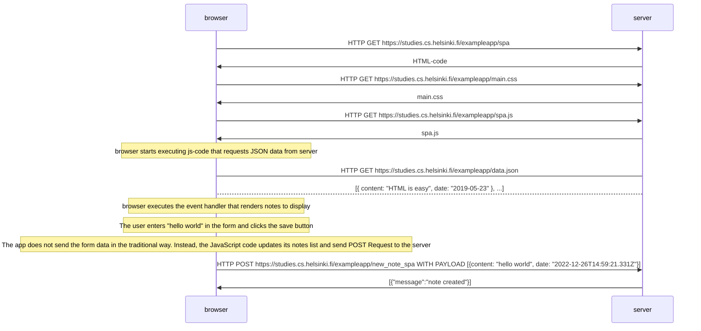

```mermaid
sequenceDiagram
  participant browser
  participant server
  browser->>server: HTTP GET https://studies.cs.helsinki.fi/exampleapp/spa
  server->>browser: HTML-code
  browser->>server: HTTP GET https://studies.cs.helsinki.fi/exampleapp/main.css
  server->>browser: main.css
  browser->>server: HTTP GET https://studies.cs.helsinki.fi/exampleapp/spa.js
  server->>browser: spa.js
  
  note over browser: browser starts executing js-code that requests JSON data from server 
 
  browser->server: HTTP GET https://studies.cs.helsinki.fi/exampleapp/data.json
  server-->browser: [{ content: "HTML is easy", date: "2019-05-23" }, ...]
  note over browser: browser executes the event handler that renders notes to display
  
  note over browser: The user enters "hello world" in the form and clicks the save button
  note over browser: The app does not send the form data in the traditional way. Instead, the JavaScript code updates its notes list and send POST Request to the server
  browser ->> server: HTTP POST https://studies.cs.helsinki.fi/exampleapp/new_note_spa WITH PAYLOAD [{content: "hello world", date: "2022-12-26T14:59:21.331Z"}]
  server ->> browser: [{"message":"note created"}]
```  
